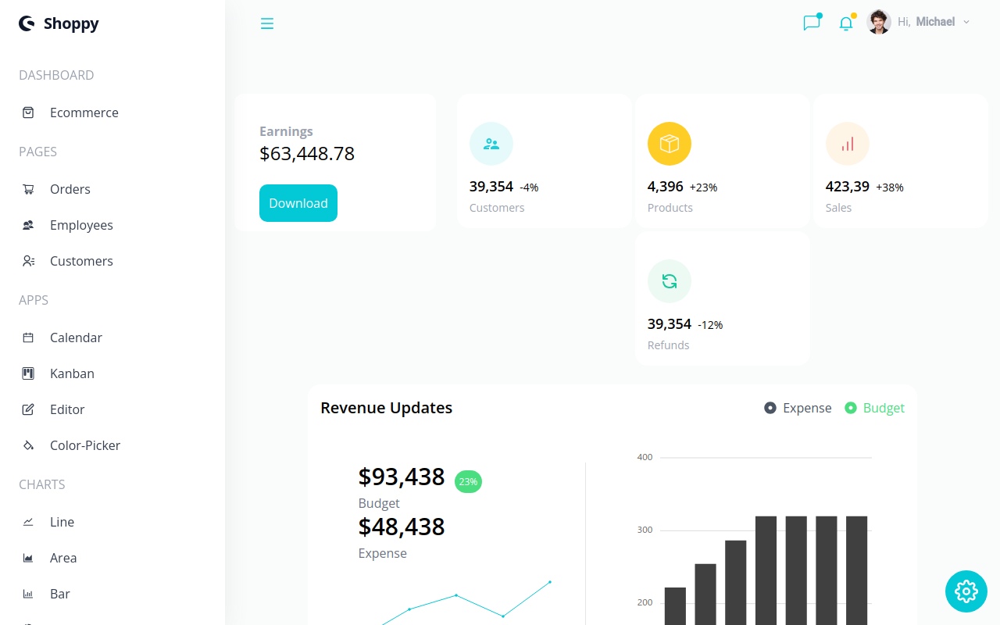

  <h1>
  Welcome To My Dashboard Panel!
</h1>
 

  
  

 

<pre style="font-size: 25px ; color: white;">
  I Created This project using :
  Reactjs 
  tailwindcss
  syncfusion 
  React Router
  you can change theme color and try dark/light mode
  there is a lot of charts that i built them easily with using syncfusion
  you can use kanban , calender , an amazing text editor , ...
  trust me you should try this project ...
  you will enjoy it!🧡
</pre>

I Deployed it on vercel and You Can See it Online :  https://dashboard-vux5.vercel.app/

demo: https://dashboard-vux5.vercel.app/
